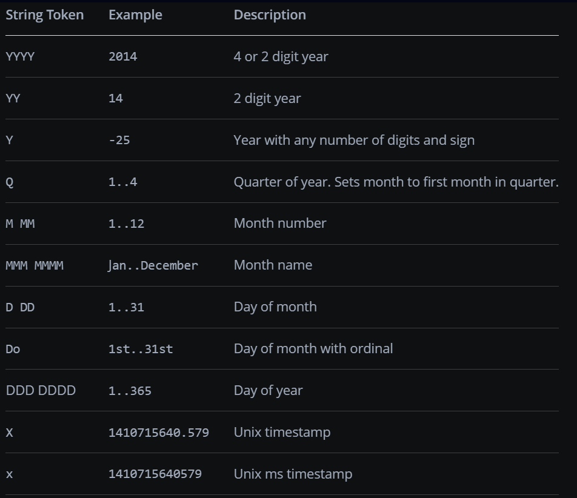

# dcc.DatePickerRange

**dcc.DatePickerRange** es un componente para representar calendarios entre los que los usuarios pueden seleccionar un rango de fechas.

Puede usar cadenas en el formato AAAA-MM-DD u objetos de fecha del módulo de fecha y hora para proporcionar fechas a los componentes de Dash. Se prefieren las cadenas porque esa es la forma que toman las fechas como argumentos de callback. Si está utilizando objetos de fecha, le recomendamos usar datetime.date para que no haya parte de tiempo. **dcc.DatePickerRange** acepta fechas con una parte de tiempo, pero esto puede resultar confuso, especialmente para la llamada inicial de un callback. Después de que el usuario elija una nueva fecha, no habrá parte de tiempo, solo la fecha. Si ya tiene el objeto adatetime.datetime, puede convertirlo con date().

## Month and Display Format

La propiedad Month_format determina cómo se muestran los encabezados del calendario cuando se abre el calendario. La propiedad display_format determina cómo se muestran las fechas seleccionadas en el componente **dcc.DatePickerRange**.

Ambas propiedades se configuran mediante cadenas que utilizan una combinación de cualquiera de los siguientes tokens.



## Simple DatePickerRange Example

Este es un ejemplo sencillo de un componente **dcc.DatePickerRange** vinculado a un callback.

Las propiedades **min_date_allowed** y **max_date_allowed** definen las fechas mínimas y máximas seleccionables en el calendario, mientras que **initial_visible_month** define el mes calendario que se muestra por primera vez cuando se abre el componente **dcc.DatePickerRange**.

```bash
1.simple_date_picker_range.py
```

## Month Format Examples


