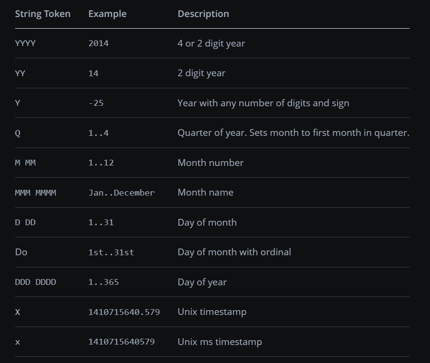

# dcc.DatePickerSingle

**dcc.DatePickerSingle** es un componente para representar un calendario desde el cual el usuario puede seleccionar una fecha.

Puede utilizar cadenas en el formato **AAAA-MM-DD** u objetos de fecha del módulo datetime para proporcionar fechas a los componentes Dash. Se prefieren las cadenas porque ese es el formato que toman las fechas como argumentos de callback. Si está utilizando objetos de fecha, le recomendamos utilizar **datetime.date** para que no haya una parte de hora. **dcc.DatePickerSingle** acepta fechas con una parte de hora, pero esto puede resultar confuso, en particular para la llamada inicial de una devolución de llamada. Después de que el usuario elija una nueva fecha, no habrá una parte de hora, solo la fecha. Si ya tiene un objeto **datetime.datetime**, puede convertirlo con **date()**.

## Month and Display Format

La propiedad **month_format** determina cómo se muestran los encabezados del calendario cuando se abre el calendario. La propiedad **display_format** determina cómo se muestran las fechas seleccionadas en el componente **dcc.DatePickerSingle**.

Ambas propiedades se configuran a través de cadenas que utilizan una combinación de cualquiera de los siguientes tokens.



## Simple DatePickerSingle Example

Este es un ejemplo simple de un componente **dcc.DatePickerSingle** vinculado a un callback.

Las propiedades **min_date_allowed** y **max_date_allowed** definen las fechas mínimas y máximas que se pueden seleccionar en el calendario, mientras que **nitial_visible_month** define el mes del calendario que se muestra primero cuando se abre el componente **dcc.DatePickerSingle**.

```bash
1.simple_date_picker_single.py
```

## Month Format Examples

